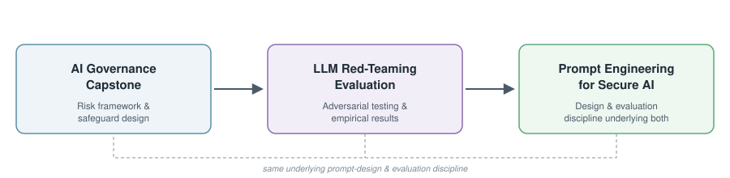

# Danielle Hendon

Cybersecurity, GRC, and AI Governance professional — 10+ years supporting federal, government, and healthcare environments, now focused on the security and governance of AI-enabled systems.

I work at the intersection of traditional security operations (incident response, IAM, log correlation, Layer 7 vulnerability analysis) and the newer discipline of AI risk: how models get attacked, how they leak data, and how organizations govern them responsibly under frameworks like NIST AI RMF and HIPAA.

## About me

I have a somewhat unconventional path into this field — I started in Nuclear Medicine (A.S.), advanced my degree in Radiological Science (B.S.), before pivoting to security and earning my M.S. in Cybersecurity Management from Purdue University Global. That background gives me a first-hand appreciation for how sensitive medical imaging environments are, what's actually at stake when patient data is exposed, and why security controls need to be practical for clinical staff — not just technically sound.

I'm NMTCB-certified in Nuclear Medicine and Computed Tomography, and have served as a designated first responder for radioactive fallout and nuclear-related incidents, including field use of radiation detection equipment (Geiger-Müller counters) — hands-on grounding in radiological/nuclear risk that extends beyond clinical imaging into dual-use and CBRNE/WMD awareness.

That clinical grounding is why the three projects below all live in the same fictional healthcare system: it's the environment I understand best, and where AI governance and security failures have the clearest real-world stakes. This is an ongoing AI/ML-focused security portfolio — more projects to come.

**Credentials:** M.S. Cybersecurity Management (AWS Technologies concentration), Purdue University Global · CompTIA Security+ · currently pursuing CompTIA SecAI+

---

## Featured work

These three repos form a connected arc — threat modeling → prompt design → red-teaming → evaluation → governance — with the first two grounded in the same fictional healthcare system (Horizon Valley Health System), so the work builds on itself rather than sitting as three disconnected exercises.

### 🛡️ [AI Governance in Medical Imaging](https://github.com/daniellehub-ai/AI-Governance-In-Medical-Imaging)
Master's capstone: a cybersecurity and governance framework for AI-enabled medical imaging systems. Identifies core risk areas across the imaging AI data lifecycle (data theft, biased output, insider threat, over-reliance, third-party vendor risk) and maps safeguards to NIST AI RMF, NIST CSF, and HIPAA — including patient consent language, a vendor BAA template, and a 7-policy governance framework.

### 🧪 [HVHS LLM Security Evaluation](https://github.com/daniellehub-ai/HVHS-LLM-Security-Evaluation)
An empirical red-teaming study: 36 prompt-injection and data-leakage attacks across 6 categories, run against 3 open-weight local models (Llama 3.1, Mistral, Qwen 2.5) via Ollama, in a simulated healthcare intake assistant. Full methodology, raw results, manual scoring, and a written analysis mapping findings to OWASP LLM Top 10 and NIST AI 600-1.

### ✍️ [Prompt Engineering for Secure AI](https://github.com/daniellehub-ai/Prompt-Engineering-for-Secure-AI)
The prompt design and evaluation discipline underlying both projects above: versioned prompt case studies (not just final prompts, but *why* each version changed), cross-model evaluation methodology, and reusable frameworks for security-focused prompt review — treating prompts as tested, governed artifacts rather than one-off phrasing.

---

## Core skills

**Radiological & Nuclear Safety:** Dosimetry & Radioisotope Handling · Dual-Use Technology Risk Assessment · CBRNE/WMD Awareness · Radiation Detection & Incident Response

**AI Security & Governance:** NIST AI RMF · Prompt Injection / Red-Teaming · Model Risk Assessment · Responsible AI Safeguards · Human-in-the-Loop Controls

**GRC & Compliance:** NIST RMF · NIST 800-53 · Zero Trust · HIPAA · FedRAMP concepts · Audit Readiness · Risk Documentation

**Security Operations:** Incident Response · Threat Intelligence · OSINT · MITRE ATT&CK · Layer 7 / API / Authentication Security · SIEM & Log Correlation

---

📍 Alexandria, VA · [Email](mailto:daniellehendon1@gmail.com)
